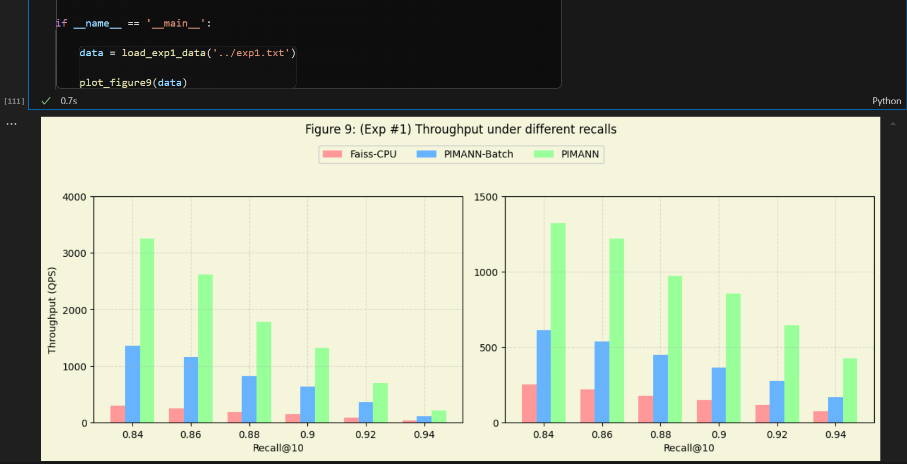
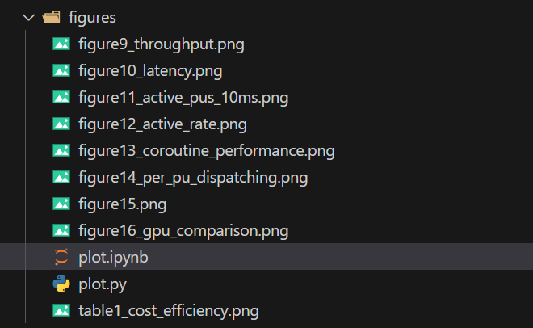
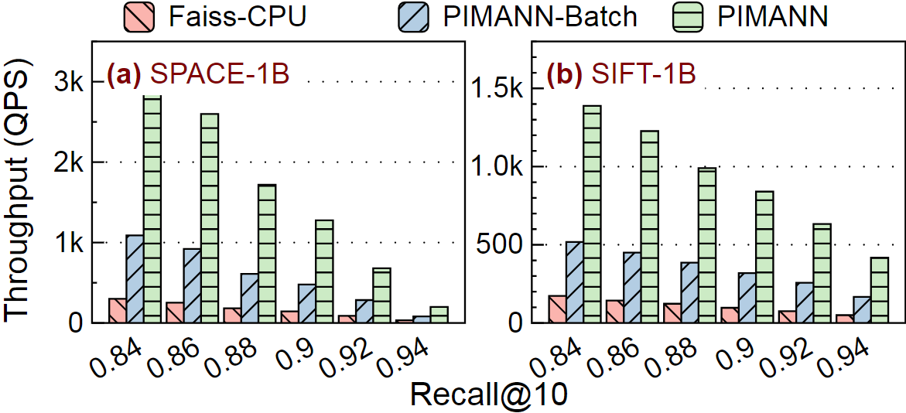

# [ATC'25 Artifact] PIMANN: Turbocharge ANNS on Real Processing-in-Memory by Enabling Fine-Grained Per-PIM-Core Scheduling

Welcome to the artifact repository of ATC'25 accepted paper: PIMANN: Turbocharge ANNS on Real Processing-in-Memory by Enabling Fine-Grained Per-PIM-Core Scheduling!

Should there be any questions, please contact the authors in HotCRP. The authors will respond to each question within 24hrs and as soon as possible.

## Main Claims

Main Claim 1: PIMANN Outperforms Existing ANNS Systems in Throughput, Latency, and Cost Efficiency

Main Claim 2: PIMANN Overcomes Batch Scheduling Limitations via Fine-Grained Per-PU Scheduling

Main Claim 3: PIMANN’s Techniques Synergistically Improve Performance 


## Environment Setup

**To artifact reviewers:** please skip this section and go to "[Evaluate the Artifact](#evaluate-the-Artifact)".
This is because we have already set up the required environment on the provided platform.

### Prerequisites
- Hardware Requirements: To run this project, UPMEM hardware is required.  https://www.upmem.com/
- UPMEM-SDK: This project uses a modified version of UPMEM-SDK based on the 2024.2 release. Original SDK: http://sdk-releases.upmem.com/2024.2.0/ubuntu_22.04/upmem-2024.2.0-Linux-x86_64.tar.gz. Installation script (Note: Modify the installation path in `install.sh` to your preferred location):
```bash
cd third-party/upmem-2024.2.0-Linux-x86_64/src/backends
bash ./install.sh
```
- FAISS: The IVFPQ index algorithm reuses portions of the FAISS codebase. For better UPMEM compatibility, we provide a modified version of FAISS based on: https://github.com/facebookresearch/faiss. Installation method is the same as FAISS.

- Boost Coroutine: This project utilizes Boost's coroutine library.
```
sudo apt-get update
sudo apt-get install libboost-coroutine-dev
```


## Evaluate the Artifact

### We have a server ready for AE


```
ssh -p 12853 wupuqing@44be1613b0de8118.natapp.cc

cd workspace/PIMANN
```

### Hello-world example

To verify that everything is prepared, you can run a hello-world example that verifies PIMANN's functionality, please run the following command:

```shell
AE/hello_world.sh
```

It will run for approximately 1 minute and, on success, output something like below:

```
yyyy-mm-dd hh:mm:ss
json_path: /home/wupuqing/workspace/PIMANN/config.json
query path is /mnt/optane/wpq/dataset/space/query10K.i8bin
query_num: 10000, dim: 100
searching SPACE1M, nprobe = 11
The command ./main 11 completed successfully.
```

If you can see this output, then everything is OK, and you can start running the artifact.

---


### Run all experiments

There is an all-in-one AE script for your convenience:

```shell
AE/run_all.sh
```

This script will run for approximately 8 hours and store all results in the `AE` directory.

We have prepared 9 scripts that run different experiments to reproduce all figures in our paper, which are the `AE/exps/expX.sh` files (X = 1, 2, ..., 8).

**<span style="color: #2E86C1; font-weight: bold;">All figure's name correspond to each other in the paper.</span>**

The all-in-one script simply invocates them one by one.
If you want to run individual experiments, please refer to these script files and the comments in them (which describes the relationship between experiments and figures/tables). Estimated operating hours are as follows:


<!-- EXP1: Overall throughput about 1.5 hours
EXP2: End-to-end latency about 1.5 hours
EXP3: PIM utilization about 1.5 hours 
EXP4: Coroutine-based bus ownership switching about 1 hours
EXP5: Effect of selective replication about 0.5 hours
EXP6: Contributions of individual techniques. about 1 hours
EXP7: Comparison with Faiss-GPU about 0.5 hours
EXP8: Cost efficiency about 0.2 hours-->

| Experiment | Description                                | Duration (hours) |
|------------|--------------------------------------------|------------------|
| EXP1       | Overall throughput                         | 1.5              |
| EXP2       | End-to-end latency                         | 1.5              |
| EXP3       | PIM utilization                            | 1.5              |
| EXP4       | Coroutine-based bus ownership switching    | 1.0              |
| EXP5       | Effect of selective replication            | 0.5              |
| EXP6       | Contributions of individual techniques     | 1.0              |
| EXP7       | Comparison with Faiss-GPU                  | 0.5              |
| EXP8       | Cost efficiency                            | 0.2              |


### Plot the figures & tables

#### (Recommended) For Visual Studio Code users

Please install the Jupyter extension in VSCode.
Then, please open `AE/plot.ipynb`.

Please activate the virtual environment (.venv/bin/python)
```
source .venv/bin/activate
```


Then, you can run each cell from top to bottom.
Each cell will plot a figure or table like below.
Titles of these figures and tables are consistent with those in the paper.





The command above will plot all figures and tables by default, and the results will be stored in the AE/figures directory.
So, please ensure that you have finished running the all-in-one AE script before running the plotter.




#### For others

Please run the plotter script in the `AE` directory:

```shell
cd AE
python3 plot.py
```

The command above will plot all figures and tables by default, and the results will be stored in the `AE/figures` directory.


So, please ensure that you have finished running the all-in-one AE script before running the plotter.

The plotter supports specifying certain figures or tables to plot by command-line arguments.
For example:

```
python3 plot.py exp1 exp2
```

Please refer to `plot.py` for accepted arguments.
```
python3 plot.py help
```


## Detailed Claims

### **Main Claim 1: PIMANN Outperforms Existing ANNS Systems in Throughput, Latency, and Cost Efficiency**  
**Sub-claims**:  
1. **Throughput (Exp1 + Exp7)**: PIMANN achieves **2.4–10.4× higher QPS** than Faiss-CPU, PIMANN-Batch, and Faiss-GPU on billion-scale datasets (SPACE-1B/SIFT-1B) at the same recall@10.  
2. **Latency (Exp2)**: PIMANN reduces **average latency by 32–43%** and **tail latency (P99) by 26–63%** compared to Faiss-CPU, eliminating inter-batch stalls.  
3. **Cost Efficiency (Exp8)**: PIMANN improves **QPS/$ by 2.4× over CPU** and **4.8× over GPU** (Table 1), leveraging UPMEM’s high memory bandwidth and parallelism.  

**Verification**:  
- Reproduce Figures 9 (throughput), 10 (latency), and Table 1 (cost) using provided scripts and datasets.  

---

### **Main Claim 2: PIMANN Overcomes Batch Scheduling Limitations via Fine-Grained Per-PU Scheduling**  
**Sub-claims**:  
1. **PU Utilization (Exp3)**: PIMANN maintains **~80% PU utilization** (vs. ~20% for PIMANN-Batch) by eliminating idle gaps between batches (Figures 11–12).  
2. **Load Balancing**: Per-PU dispatching ensures **uniform task distribution** across PUs (Figure 5b → Figure 14a).  

**Verification**:  
- Profile active PU counts over time and compare utilization metrics (Figure 11-12).  

---

### **Main Claim 3: PIMANN’s Techniques Synergistically Improve Performance**  
**Sub-claims**:  
1. **Coroutines (Exp4)**: Hiding bus-switching latency with coroutines boosts throughput **3×** (Figure 13).  
2. **Selective Replication (Exp5)**: Throughput **increases with memory budget** (Figure 14b).  
3. **Combined Techniques (Exp6)**:  
   - Persistent PIM kernel alone improves throughput by **30–70%**.  
   - Adding per-PU dispatching further increases gains to **88–112%** (Figure 15).  

**Verification**:  
- Ablation studies (Figures 13–15) using config flags to enable/disable techniques.  

---


<!-- # Data Preparation

## Datasets
Example datasets: sift1B and space1B  
- sift1B: http://corpus-texmex.irisa.fr/  
- space1B: https://github.com/microsoft/SPTAG/tree/main/datasets/SPACEV1B  

Following the approach from https://big-ann-benchmarks.com/neurips21.html, we trimmed space1B to retain:
- First 1 billion dataset vectors  
- 10,000 query vectors  

Training scripts:
- `./train_sift1B`: On a 40-logical-core CPU, training takes ~27 hours with default parameters  
- space1B follows similar training procedure  

## Dataset Configuration
Modify `config.json` to switch datasets. Example configuration (parameter names are self-explanatory; `RESULT_DIR` stores query test results):
```json
{
  "MAX_CLUSTER": 4096,
  "RESULT_DIR": "SPACE1B20M4096_DIR",
  "INDEX_PATH": "/mnt/optane/wpq/dataset/space/index/space1B_M20_PQ8_C4096_R_L2.faissindex",
  "QUERY_PATH": "/mnt/optane/wpq/dataset/space/query10K.i8bin",
  "GROUNDTRUTH_PATH": "/mnt/optane/wpq/dataset/space/space1B_L2_gt_k100.bin"
}
```

Additionally, modify macros in `./common/dataset.h`:
```cpp
// For sift1B
#define MY_PQ_M 32
#define DIM 128
#define QUERY_TYPE 0

// For space1B
// #define MY_PQ_M 20
// #define DIM 100
// #define QUERY_TYPE 1
```

## Data Format Specification
All datasets/queries/groundtruth use binary format. For sift1B:  
- **Dataset**: 2 × int32 (vector count + dimensions) + (vector count × dimensions × uint8)  
- **Training set**: Same as dataset  
- **Query set**: Same as dataset  
- **Groundtruth**: 2 × int32 (vector count + topk) + (vector count × topk × int32)  

Modify `/common/dataset.h` and `/host/util.cpp` for custom formats.

--- -->


<!-- # Experimental Results

## Benchmark Comparisons
- **Faiss-CPU**: https://github.com/facebookresearch/faiss  
- **PIMANN-Batch**: Traditional batch-scheduled UPMEM acceleration  
- **PIMANN**: Our proposed per-PU scheduled UPMEM acceleration  

## Metrics
- Recall@10  
- Throughput  
- Latency  

## Throughput


 -->


