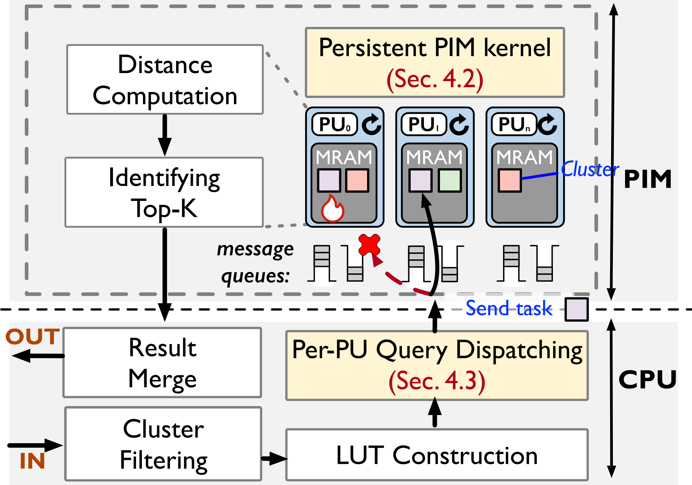

# PIM-ANNS: Accelerating ANNS on Commodity PIM Hardware

This is the official implementation of **PIM-ANNS**, a high-performance framework that accelerates Approximate Nearest Neighbor Search (ANNS) on UPMEM Processing-in-Memory (PIM) hardware via fine-grained per-core scheduling, coroutine-based bus switching, and selective index replication.

## 🏆 Publications & Awards

- **USENIX ATC 2025** (*Best Storage-Related Paper Award*): [**Turbocharge ANNS on Real Processing-in-Memory by Enabling Fine-Grained Per-PIM-Core Scheduling**](https://www.usenix.org/conference/atc25/presentation/wu-puqing)
- **ACM Transactions on Storage (TOS) 2026**: [**Unlocking PIM-Core Capabilities for Efficient ANNS on Commodity Processing-in-Memory Hardware**](https://dl.acm.org/doi/10.1145/3806055)

## 📋 Overview

This figure shows the workflow of an ANNS query in PIM-ANNS.
It supposes `PU_0` is overloaded.
Our per-PU query dispatching will dispatch this query to the replica on `PU_1`.



### Directory structure

```
common/              # shared files for both DPU and host programs
dpu/                 # DPU kernel functions
host/                # host programs interacting with DPU kernels
third-party/
   ├── upmem-2024.2.0-Linux-x86_64/  # modified UPMEM-SDK
   └── faiss_upmem/                  # modified FAISS
AE/                  # experiment scripts and plotting tools
main.cpp             # main program entry point
```

## 🛠️ Environment Setup

### Prerequisites

**Hardware:** UPMEM hardware is required. See https://www.upmem.com/

**Software:** Install the following dependencies.

- **UPMEM-SDK:** This project uses a modified UPMEM-SDK based on the 2024.2 release. Original SDK: http://sdk-releases.upmem.com/2024.2.0/ubuntu_22.04/upmem-2024.2.0-Linux-x86_64.tar.gz

```bash
cd third-party/upmem-2024.2.0-Linux-x86_64/src/backends
bash ./install.sh
```

Note: modify the installation path in `install.sh` to your preferred location.

- **FAISS:** A modified FAISS for UPMEM compatibility, based on https://github.com/facebookresearch/faiss

```bash
cd third-party/faiss_upmem
cmake -B build .
make -C build -j faiss
make -C build install
```

- **Boost Coroutine:**

```bash
sudo apt-get update
sudo apt install libboost-all-dev
```

## 🔨 Build

```bash
cmake -B build .
cd build
make -j
```

## 💾 Data Preparation

### Datasets

Example datasets: SIFT-1B and SPACEV-1B

- SIFT-1B: http://corpus-texmex.irisa.fr/
- SPACEV-1B: https://github.com/microsoft/SPTAG/tree/main/datasets/SPACEV1B

Following the approach from https://big-ann-benchmarks.com/neurips21.html, we trimmed SPACEV-1B to retain:

- First 1 billion dataset vectors
- 10,000 query vectors

Training scripts:

- `./train_sift1B`: on a 40-logical-core CPU, training takes ~27 hours with default parameters
- SPACEV-1B follows a similar training procedure

### Dataset configuration

Modify `config.json` to point to your local dataset and index paths. Example presets are provided in the repository root (e.g., `space1M-20M-4096C.json`, `space1B-20M-4096C.json`, `sift1B-32M-4096C.json`).

```json
{
  "MAX_CLUSTER": 4096,
  "RESULT_DIR": "SPACE1B20M4096_DIR",
  "INDEX_PATH": "/path/to/your/index.faissindex",
  "QUERY_PATH": "/path/to/your/query.i8bin",
  "GROUNDTRUTH_PATH": "/path/to/your/groundtruth.bin"
}
```

Additionally, modify macros in `common/dataset.h`:

```cpp
// For SIFT-1B
#define MY_PQ_M 32
#define DIM 128
#define QUERY_TYPE 0

// For SPACEV-1B
// #define MY_PQ_M 20
// #define DIM 100
// #define QUERY_TYPE 1
```

### Data format

All datasets, queries, and groundtruth use binary format. For SIFT-1B:

- **Dataset:** 2 × int32 (vector count + dimensions) + (vector count × dimensions × uint8)
- **Training set:** same as dataset
- **Query set:** same as dataset
- **Groundtruth:** 2 × int32 (vector count + topk) + (vector count × topk × int32)

Modify `common/dataset.h` and `host/util.cpp` for custom formats.

## 🚀 Quick Start

After configuring datasets (see above), run the hello-world example to verify the setup:

```bash
AE/hello_world.sh
```

On success, you should see output similar to:

```
searching SPACE1M, nprobe = 11
The command ./main 11 completed successfully.
```

Note: update `PROJECT_ROOT` in `AE/hello_world.sh` and dataset paths in `config.json` before running.

## 🔬 Reproduce Paper Results

Scripts under `AE/` reproduce the experiments in our paper. See [AE/README.md](AE/README.md) for the full artifact evaluation guide, including experiment descriptions, expected runtimes, and claim verification details.

Quick reference:

```bash
# Run all experiments (~8 hours)
AE/run_all.sh

# Run a specific experiment
AE/exps/exp1.sh

# Plot results
cd AE/figures
python3 plot.py
```

| Experiment | Description                                | Duration (hours) |
|------------|--------------------------------------------|------------------|
| EXP1       | Overall throughput                         | 1.5              |
| EXP2       | End-to-end latency                         | 1.5              |
| EXP3       | PIM utilization                            | 1.5              |
| EXP4       | Coroutine-based bus ownership switching    | 1.0              |
| EXP5       | Effect of selective replication            | 0.5              |
| EXP6       | Contributions of individual techniques     | 1.0              |
| EXP7       | Comparison with Faiss-GPU                  | 0.5              |
| EXP8       | Cost efficiency                            | 0.2              |

## 📖 Citation

If you use PIM-ANNS in your research, please cite our papers:

```bibtex
@inproceedings{wu2025turbocharge,
  title={Turbocharge ANNS on Real Processing-in-Memory by Enabling Fine-Grained Per-PIM-Core Scheduling},
  author={Wu, Puqing and Xie, Minhui and Zhao, Enrui and Zhang, Dafang and Wang, Jing and Liang, Xiao and Ren, Kai and Chai, Yunpeng},
  booktitle={2025 USENIX Annual Technical Conference (USENIX ATC 25)},
  pages={1223--1241},
  year={2025}
}

@article{wu2025unlocking,
  title={Unlocking PIM-Core Capabilities for Efficient ANNS on Commodity Processing-in-Memory Hardware},
  author={Wu, Puqing and Xie, Minhui and Zhao, Enrui and Zhang, Dafang and Wang, Jing and Liang, Xiao and Ren, Kai and Chai, Yunpeng},
  journal={ACM Transactions on Storage},
  year={2025},
  publisher={ACM New York, NY}
}
```
